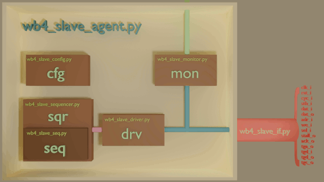

# Wishbone Pipeline Slave Verification Agent Specifications

Document      | Metadata
:------------ | :-----------------------------
_Version_     | v0.0.1
_Prepared by_ | Jose R Garcia
_Project_     | UVM-Python Verification Library

## Overview

Python code for a Wishbone Slave(Pipelined) Bus Interface verification agent

## Table Of Contents

<!-- TOC depthFrom:1 depthTo:6 withLinks:1 updateOnSave:1 orderedList:0 --> - [Wishbone Pipeline Slave Verification Agent Specifications](#orcr32i-synthesizable-unit-specification)
  - [Overview](#overview)
  - [Table Of Contents](#table-of-contents)
  - [1 Syntax and Abbreviations](#1-syntax-and-abbreviations)
  - [2 Design](#2-design)
  - [3 Agent Configuration](#3-agent-configuration)
  - [4 Interfaces](#4-interfaces)
    - [4.1 Instruction WB Slave Read](#41-instruction-WB-Slave-read)
  - [5 Generic Parameters](#5-generic-parameters)
  - [6 Register Space](#6-register-space)
    - [6.1 General Register _n_](#61-general-register-n)<!-- /TOC -->

 ## 1 Syntax and Abbreviations

Term        | Definition
:---------- | :---------------------------------
0b0         | Binary number syntax
0x0000_0000 | Hexadecimal number syntax
bit         | Single binary digit (0 or 1)
BYTE        | 8-bits wide data unit
DWORD       | 32-bits wide data unit
LSB         | Least Significant bit
MSB         | Most Significant bit
UVM         | Universal Verification Methodology
WB          | Wishbone

## 2 Design

|  
| :-----------------------------------------------:
| Figure 1 : Agent's Top Level Diagram

## 3 Agent Configuration

Signals | Initial State | Direction | Definition
:------ | :-----------: | :-------: | :-----------------------------------------------
`clk_i` |      N/A      |    In     | Input clock. Data is sampled on the rising edge.
`rst_i` |      N/A      |    In     | Synchronous reset.
## 4 Interfaces

The wb_mater_if...

### 4.1 Instruction WB Slave Read

Signals   | Initial State | Direction | Definition
:-------- | :-----------: | :-------: | :-----------------------
`adr_o`   |      0        |    Out    | Read Address signal.
`dat_i`   |      N/A      |    In     | Read response data.
`dat_o`   |      0        |    Out    | Write data signal.
`we_o`    |      0        |    In     | Read acknowledge signal.
`sel_o`   |      0        |    In     | Read acknowledge signal.
`stb_o`   |      0        |    In     | Request signal.
`ack_i`   |      N/A      |    In     | Acknowledge signal.
`cyc_o`   |      0        |    In     | Packet cycle signal.
`stall_i` |      N/A      |    In     | Stall signal.
`tga_o`   |      0        |    In     | Tag signal.
`tgd_i`   |      N/A      |    In     | Tag signal.
`tgd_o`   |      0        |    In     | Tag signal.
`tgc_o`   |      0        |    In     | Tag signal.

## 5 Sequence Item

Fields                  | Description
:---------------------- | :---------------------------------------------------
`data_in`               | data fed to the UUT
`stall`                 | stall value
`response_data_tag`     | tgd_i value
`acknowledge`           | ack_i value
`transmit_delay`        | amount of sim clocks before feeding this item to the UUT

## 6 Sequences

### 6.1 read_single_sequence

Fields                  | Description
:---------------------- | :---------------------------------------------------
`data`                  | data fed to the UUT
`stall`                 | stall value
`response_data_tag`     | tgd_i value
`acknowledge`           | ack_i value
`transmit_delay`        | amount of sim clocks before feeding this item to the UUT

### 6.1 write_single_sequence

Fields                  | Description
:---------------------- | :---------------------------------------------------
`stall`                 | stall value
`response_data_tag`     | tgd_i value
`acknowledge`           | ack_i value
`transmit_delay`        | amount of sim clocks before feeding this item to the UUT

